# Geometricon

Generate unique, symmetrical geometric icons from hash strings. Perfect for creating user avatars, visual identifiers, or decorative elements with a clean, modern aesthetic.

## Features

- Generates unique geometric icons from any hash string
- Deterministic: same hash always produces the same icon
- **Symmetrical Compositions**: 5 structured layouts for visual harmony (centered, radial, split, frame, random)
- **Clean Geometric Design**: 7 shapes by default for rich, balanced patterns
- **Geometric Shapes**: Circles, squares, triangles, hexagons, and diamonds
- **Professional Aesthetics**: Symmetrically arranged shapes with clean angles (90° rotations)
- **Gradient Support**: Optional linear and radial gradients for modern, vibrant aesthetics
- Multiple color schemes: pastel, vibrant, warm, cool, monochrome, earth, ocean, sunset
- Custom color support: single color, custom palettes, or preset schemes
- Transparent background - just the shapes
- Pure TypeScript with no dependencies
- Outputs clean SVG format

## Visual Examples

### Composition Modes

| Centered | Radial | Split | Frame |
|:--------:|:------:|:-----:|:-----:|
| 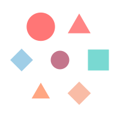 | 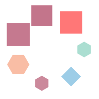 | 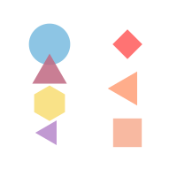 | 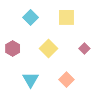 |
| Default layout | Circular arrangement | Left/right division | Perimeter border |

### Color Schemes

| Pastel | Vibrant | Ocean | Sunset |
|:------:|:-------:|:-----:|:------:|
| 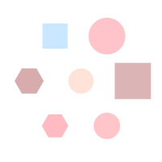 | 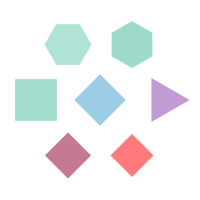 |  | 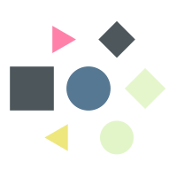 |

| Warm | Cool | Gradient |
|:----:|:----:|:--------:|
| 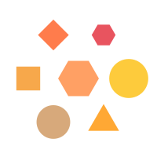 |  | 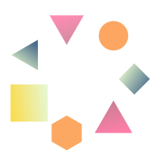 |

### Shape Types

| Circle | Square | Triangle | Hexagon | Diamond |
|:------:|:------:|:--------:|:-------:|:-------:|
| 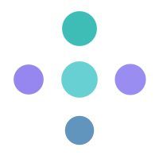 |  | 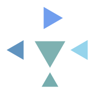 | 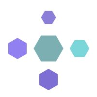 | 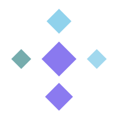 |

## Installation

```bash
npm install
npm run build
```

## Usage

### CLI Usage

```bash
# Basic usage - generates 7 symmetrical shapes with centered composition
geometricon abc123def456 -o icon.svg

# Generate from MD5 of text
echo -n "hello" | md5 | xargs geometricon -o hello-icon.svg

# Fixed 3 shapes, only circles and squares
geometricon abc123 --shape-count 3 --shapes circle,square -o simple.svg

# Specific geometric shapes
geometricon abc123 --shapes triangle,hexagon,diamond --shape-count 5 -o geometric.svg

# Use a single color for all shapes
geometricon abc123 --color "#3498DB" -o single-color.svg

# Use a preset color scheme
geometricon abc123 --color-scheme ocean -o ocean.svg

# Use a custom color palette
geometricon abc123 --color-palette "#FF5733,#33FF57,#3357FF" -o custom-palette.svg

# Use composition modes for different layouts
geometricon abc123 --composition centered -o icon.svg     # Default: focused, professional
geometricon abc123 --composition radial -o icon.svg       # Circular arrangement
geometricon abc123 --composition split -o icon.svg        # Left/right division
geometricon abc123 --composition frame -o icon.svg        # Decorative border

# Use gradients for modern aesthetics
geometricon abc123 --use-gradients -o gradient-icon.svg
geometricon abc123 --use-gradients --color-scheme ocean -o ocean-gradient.svg

# Combine options
geometricon abc123 --composition radial --color-scheme vibrant --shape-count 5 -o icon.svg
```

Run `geometricon --help` for full documentation.

### Node.js API

#### Basic Usage

```javascript
const { generateIcon } = require('./dist/index');
const crypto = require('crypto');

// Generate a hash (or use any existing hash)
const hash = crypto.createHash('md5').update('user@example.com').digest('hex');

// Generate the icon (7 shapes, centered composition by default)
const svg = generateIcon(hash);

console.log(svg); // SVG string output
```

#### With Options

```javascript
// Fixed number of shapes
const svg = generateIcon(hash, {
  size: 300,
  shapeCount: 5
});

// Only specific shape types
const svg = generateIcon(hash, {
  allowedShapes: ['circle', 'triangle', 'hexagon']
});

// Single color for all shapes
const svg = generateIcon(hash, {
  color: '#3498DB'
});

// Custom color palette
const svg = generateIcon(hash, {
  colorPalette: ['#FF6B6B', '#4ECDC4', '#45B7D1', '#FFA07A']
});

// Preset color scheme
const svg = generateIcon(hash, {
  colorScheme: 'ocean'
});

// Composition modes for professional layouts
const svg = generateIcon(hash, {
  composition: 'centered'  // Options: 'centered', 'radial', 'split', 'frame', 'random'
});

// Use gradients for modern aesthetics
const svg = generateIcon(hash, {
  useGradients: true,
  colorScheme: 'vibrant'
});

// Combine composition with other options
const svg = generateIcon(hash, {
  composition: 'radial',
  colorScheme: 'warm',
  shapeCount: 5,
  useGradients: true
});
```

### Generate Icon Data Without Rendering

```javascript
const { generateIconData } = require('./dist/index');

const iconData = generateIconData(hash, { size: 200 });
// Returns: { backgroundColor, shapes, size }
// You can use this data to render in other formats
```

## Examples

### Node.js Example

```javascript
const { generateIcon } = require('./dist/index');
const fs = require('fs');
const crypto = require('crypto');

// Create icon for a user
const userEmail = 'alice@example.com';
const hash = crypto.createHash('md5').update(userEmail).digest('hex');
const icon = generateIcon(hash, {
  size: 200,
  composition: 'centered',
  colorScheme: 'pastel'
});

// Save to file
fs.writeFileSync('avatar.svg', icon);
```

### Web Usage

```html
<!DOCTYPE html>
<html>
<body>
  <div id="icon-container"></div>

  <script src="dist/index.js"></script>
  <script>
    // Generate icon for a user ID
    const userId = "user123";
    const hash = simpleHash(userId); // Use your preferred hashing method
    const svg = generateIcon(hash, {
      size: 150,
      composition: 'radial',
      colorScheme: 'cool'
    });

    document.getElementById('icon-container').innerHTML = svg;
  </script>
</body>
</html>
```

## How It Works

1. Takes any hash string (MD5, SHA256, or any hex string)
2. Uses portions of the hash to deterministically generate:
   - Shape types from geometric options (circle, square, triangle, hexagon, diamond)
   - Number of shapes (default: 7)
   - Shape positions based on composition mode
   - Shape sizes (15-25% of canvas to accommodate 7 shapes)
   - Clean rotations (0°, 90°, 180°, 270°)
   - Colors from selected scheme or palette
   - Opacity levels (75-95%) for subtle layering effects
3. Applies symmetrical composition:
   - Shapes arranged using structured layouts (centered, radial, split, frame)
   - Mathematical precision for perfect symmetry
   - All shapes constrained within SVG bounds with 5% padding
4. Renders everything as clean SVG with transparent background

## API Reference

### `generateIcon(hash: string, options?: IconOptions): string`

Generates an SVG icon from a hash string.

**Parameters:**
- `hash` (string): Any hash string (preferably hex)
- `options` (optional): Configuration object

**Available Options:**

| Option | Type | Default | Description |
|--------|------|---------|-------------|
| `size` | number | 200 | Icon size in pixels |
| `useComplexity` | boolean | true | Use hash complexity to determine shape count |
| `shapeCount` | number | 7 | Fixed number of shapes |
| `shapeCountMin` | number | - | Minimum shapes (random between min-max) |
| `shapeCountMax` | number | - | Maximum shapes |
| `allowedShapes` | string[] | all | Allowed shape types: 'circle', 'square', 'triangle', 'hexagon', 'diamond' |
| `composition` | string | 'centered' | Composition mode: 'centered', 'radial', 'split', 'frame', 'random' |
| `color` | string | - | Single fixed color for all shapes (hex format: '#FF5733') |
| `colorPalette` | string[] | - | Custom array of colors to choose from (hex format) |
| `colorScheme` | string | - | Preset color scheme: 'pastel', 'vibrant', 'warm', 'cool', 'monochrome', 'earth', 'ocean', 'sunset' |
| `saturationMin` | number | 40 | Minimum color saturation (0-100) |
| `saturationMax` | number | 65 | Maximum color saturation (0-100) |
| `lightnessMin` | number | 70 | Minimum color lightness (0-100) |
| `lightnessMax` | number | 88 | Maximum color lightness (0-100) |
| `opacityMin` | number | 0.75 | Minimum shape opacity (0-1) |
| `opacityMax` | number | 0.95 | Maximum shape opacity (0-1) |
| `useGradients` | boolean | false | Use linear/radial gradients instead of solid colors |

**Returns:** SVG string

**Color Option Priority:**

When multiple color options are specified, they are applied in this priority order:
1. `color` - Single fixed color (highest priority)
2. `colorPalette` - Custom color palette
3. `colorScheme` - Preset color scheme
4. HSL generation using `saturationMin/Max` and `lightnessMin/Max` (default)

**Available Color Schemes:**
- `pastel` - Soft, gentle colors (default aesthetic)
- `vibrant` - Bold, saturated colors
- `warm` - Reds, oranges, yellows
- `cool` - Blues, purples, teals
- `monochrome` - Grayscale palette
- `earth` - Browns, tans, natural tones
- `ocean` - Blues and teals
- `sunset` - Warm to cool gradient colors

### `generateIconData(hash: string, options?: IconOptions): IconData`

Generates the icon data structure without rendering to SVG.

**Returns:** Object with:
- `backgroundColor` (string): Background color
- `shapes` (Shape[]): Array of shape objects
- `size` (number): Icon size

## Composition Modes

The library includes 5 composition strategies for professional, visually harmonious icons:

### Available Compositions:

- **centered** (default): One large central shape with others arranged in a circle around it
  - Creates a clear focal point
  - Best for most use cases - clean and professional
  - With 7 shapes: 1 center + 6 surrounding

- **radial**: All shapes arranged symmetrically in a perfect circle
  - Balanced, symmetrical feel
  - Good for decorative icons
  - Even distribution around center point

- **split**: Clean left/right or top/bottom division
  - Modern, minimalist aesthetic
  - Shapes mirrored on both sides
  - Good for duo-tone effects

- **frame**: Shapes distributed around the perimeter
  - Border/frame aesthetic
  - Professional and contained
  - With 7 shapes: 1 center + 6 around perimeter

- **random**: Original random positioning (legacy behavior)
  - No structured layout
  - Not recommended for professional use

### Default Behavior:
- **Shape count**: 7 shapes for rich geometric patterns
- **Composition**: `centered` for professional appearance
- **Shapes**: All geometric types (circle, square, triangle, hexagon, diamond)
- **Rotations**: Clean 90° increments (0°, 90°, 180°, 270°)
- **Result**: Clean, symmetrical icons suitable for websites!

## Shape Types

The generator creates geometric shapes with perfect symmetry:

- **Circle**: Perfect circles rendered at center point
- **Square**: Squares with clean 90° rotations
- **Triangle**: Equilateral triangles pointing in various directions
- **Hexagon**: Regular hexagons with 6-sided symmetry
- **Diamond**: Diamond shapes (squares rotated 45°)

Each shape features:
- Symmetrical positioning based on composition mode
- Clean rotations (0°, 90°, 180°, 270°)
- Colors from selected scheme or palette
- Semi-transparent opacity (75-95%) for subtle layering
- Guaranteed to stay within SVG bounds
